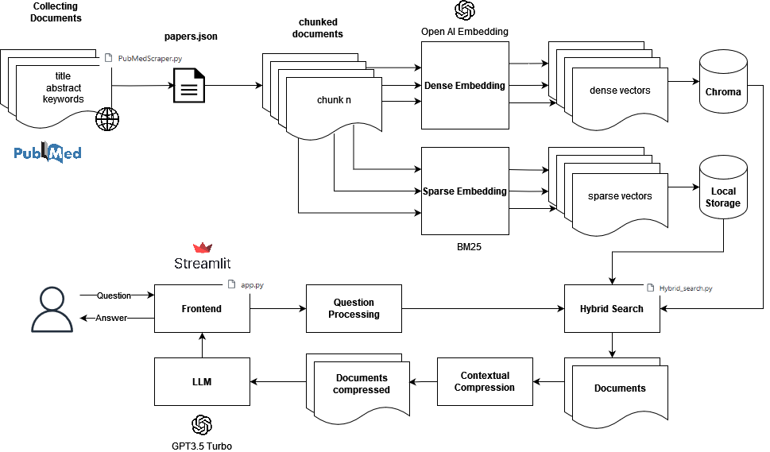

# Q&A RAG for medical questions

NLP Project Group 20

| Github-UserName     | StudentName | Matrikelnummer     |
|----------|-----|----------------|
|   Ibinmbiju   | Ibin Mathew Biju  | 3770662 |
|   AnuR1234  | Anu Reddy | 3768482  |
|   nokitoino   | Burhan Akin Yilmaz | 4114082    |
|   nr59684   | Nilesh Parshotam Rijhwani | 3771253    |

## Table of Contents
1. [Introduction](#1-introduction)
2. [Members Contribution](#2-members-contribution)
3. [RAG Pipeline](#3-rag-pipeline)
4. [Experimental Setup](#4-experimental-setup)
5. [Evaluation](#5-evaluation)
6. [Medical QA-system Demo](#6-medical-qa-system-demo)
7. [Resources](#7-resources)
8. [License](#8-license)

## 1. Introduction

In the realm of information retrieval and natural language processing, the development of question-answering (QA) systems represents a significant frontier. These systems are designed to bridge thegap between human queries and vast repositories of textual data, enabling users to extract precise and relevant information efficiently. Our project delves into the creation of a domain-specific QA system tailored for the medical domain, utilizing articles accessible via the PubMed portal as our primary
corpus.

The motivation behind our endeavor lies in the increasing volume of medical literature being generated and the necessity for healthcare professionals and researchers to access pertinent information swiftly and accurately. PubMed, as one of the largest repositories of biomedical literature, offers a rich source of data for our QA system, enabling us to address a wide array of inquiries ranging from clinical queries to research investigations.

Our system aims to transform natural language questions into actionable answers by leveraging advanced techniques in information retrieval, natural language understanding, and text processing. By ingesting a diverse range of question types – from fact-based inquiries to complex hypothetical scenarios – our system endeavors to provide comprehensive and accurate responses, thereby enhancing the efficiency of information retrieval in the medical domain.

Through this report, we elucidate our methodology, detailing the steps taken in data acquisition, system architecture design, and evaluation. Furthermore, we reflect on the challenges encountered during the project and provide insights into potential avenues for future improvement and expansion of our QA
system.

In summary, our project represents a concerted effort to harness the power of natural language processing and domain-specific knowledge to facilitate seamless access to medical literature, ultimately advancing research, clinical practice, and healthcare outcomes.

## 2. Members Contribution

1. Anu Reddy:
   - Performed data analysis on the documents from pubmed url link.
   - Performed data retrieval on the combined documents in ndjson format (provided by akin) via writing queries in elastic search in Python( and cross-verified in kibana) and optimized the queries to retrieve the documents using both keyword and vector search on the textual components of the dataset(title and abstract).
   - Performed some test queries by providing the questions as input and retrieving the corresponding documents along with their cosine similarity scores.
   - Experimented with different Embeddings models (openAI,BGE embeddings) and the comparison report has been shared [here](https://docs.google.com/document/d/1oVKGwl1XahiJP7jK8ojgg4UXNGZ2AUEMDeUFgmyyIZQ/edit?usp=sharing)
   - Worked with Hybrid search (Ensemble Retriver = BM25 retriever+Faiss retriever) (implementation will be uploaded soon)
   - Experimented with usage of different LLMs (openAI,Huggingfacehub(HuggingFaceH4/zephyr-7b-beta) and bloke model Medalpeca(medical LLM) to generate the context (implementation will be uploaded soon))
   - Working on implementation of Hybrid Search
   - Looking to different evaluating metrics 
2. Akin Yilmaz:
   - Developed the PudMedScraper.py using Entrez. Bypassed the Ratelimit of 9999 files using date intervalls. Created the JSON format in cooperation with the others.
   - Testing a parallel Pipeline using Haystack for the entire workflow. Implemented simple pipeline using the DocumentStore using Elasticsearch and experimented with the TF-IDF (sparse) Retriever, and T5 as LLM, aborted the continuation due to the group agreement to stick to LangChain.
   - Implemented and commented embedding_evaluation.py
   - Only Commented and uploaded Embedding-OpenAI-Chroma.ipynb, which was implemented by Anu Reddy.
   - Implemented LLM-GPT3.5-Turbo.ipynb, which is the continuation of our base Notebook Embedding-OpenAI-Chroma.ipynb. It uses GPT3.5 Turbo as LLM.
   - Implemented Evaluation-Contextual-Compression.ipynb based on the ideas used in the lectures last assignment. Uses LLMExtractor, and different metrics to evaluate the performance of our entire pipeline with the help of Hugging Face pubmed_qa dataset.
3. Nilesh Rijhwani:
   - Working on the automation of webscrapping where I am using following structure to maintain timely webscarpping (Droped due to time constraint):
      - Using Python scheduler library - APScheduler
      - Also storing the last scrapped date in a text file amd using functions to access and update the same before putting it in query.
   - Defined a chunk size of 1000 to start working on the experimental phase where the inout json from the webscrapping (papers.json) is brokendown in to defined chunksize and stored as json which later will be used in ambedding.py as an input to our ambedding function
   - Worked on embedding model and function, current decision - 'text_davinci_003' which is gonna be deprectaed in jan 2024, next model --> gpt-3.5-turbo-1106
      - Implemented the Embedding model for PubMed Documents using OpenAI's GPT-3 API.
   - Worked on the pubmedbert LLM for generating the response
   - Performed evaluation of LLMs based on BERT, BLEU and Rogue Score as primary metrics
   - Worked on follow-up questions generation using openai based on compressed context(Developed by Akin)
   - Worked on DOCUMENTATION.md formating and editing and transfering the report from latex to markdown
4. Ibin Mathew Biju:
   - Experimented with different embedding models such as openAI and compared its performance.
   - Researched and worked on different vector stores such as FAISS, chromaDB, pinecone to figure out the best suitable vector store for the architecture.
   - Implemented FAISS vector store and integrated with the current embedding files and did vector search.
   - Worked on different LLMs and experimenting different combinations for better results.
   - Researched about various front end possibilities and hosting services and finally decided to use streamlit for front end and huggingface spaces for free hosting.
   - Developed and Refactored and fine tuned the code for front end
   - Integrated and deployed the model and Designed the UI.

## 3. RAG Pipeline
### 3.1 Pipeline

<center>


</center>
<center>Fig. 1. RAG Pipeline </center>
<br>

The pipeline consists of four components. In the following we will describe every components functionality and interactions in detail. In [section 4](#4-experimental-setup) we will describe the specific setting we use, i.e. used framework and libraries.

### 3.2 Data Collection

The first component of our pipeline collects the medical documents. We want the QA system to derive the answers from the relevant abstracts of the medical documents. To be able filter out the relevant
documents we will only collect information about the title, abstract and keywords of each document.
We do not include information about the author, the document publication ids, references, etc., since
these entries do not contain any valuable information to genearate an answer for a medical question.
Being restricted to these entries also reduces the size of our document store, which we will discuss now.

### 3.3 Dense Retriever and Document Store

The realm of Retrieval-Augmented Generation (RAG) involves a process: it transforms text into high-
dimensional vectors–embeddings–that capture semantic and contextual nuances. These dynamic entities,
stored in optimized vector databases for swift similarity searches, empower machines to process complex
queries with speed and accuracy. By integrating these embeddings and the use of vector databases within
RAG systems; consequently, this fosters contextually appropriate responses—diverse yet precise—which
heralds an unprecedented era in language model capabilities. In 2020, Patrick Lewis and his team at
Meta introduced RAG technology: a significant advancement in language models. It enhances responses
with dynamically updated information; fosters transparency–crucial to AI-user interactions; and enables
personalized communication.

The innovative approach of RAG not only enhances response accuracy but also obviates constant model
retraining, thus maintaining system currency and efficiency. RAG incorporates subtle user details and
offers source attribution features to enable personalized interactions; this fosters trust between users
and AI systems. In heralding a new era in AI communication, this technology positions itself as an
indispensable tool for crafting informed—contextually resonant—responses across diverse domains. In
our pipeline, we do not restrict ourselves to dense embeddings only, but rather to a combination of sparse
and dense embeddings as seen in the diagram XY. The justification for this can be found in subsection
XY 6.

### 3.4 Sparse Retriever

A search based on keywords, also known as sparse vector search, relies on creating sparse ”embeddings”.
Most values in the vector are 0, except for a few non-zero values. Algorithms like BM25 are used to
create these sparse embeddings, which are build upon the TF-IDF approach. Essential keywords are
extracted and distractions are removed from the search query and documents. A sparse embedding is
generated for each document based on the frequency of keywords using algorithms like BM25.The search
query is converted into a sparse embedding using the same algorithm.Cosine similarity or other metrics
are used to compare the query embedding with each document’s embedding. Documents are ranked
based on their similarity scores. The most relevant documents are displayed first in the search results.

### 3.5 Hybrid Search

As mentioned we do not restrict ourselves to a dense retriever, but rather to a combination of dense
and sparse retrievers. This concept is called hybrid search. The justification to use hybrid search can
be found in section XY.

The hybrid search combines keyword-based and vector search strategies to leverage their respective
strengths. By incorporating vector search independently, it positively impacts the retrieval process. Hy-
brid search combines keyword-based and vector search strategies to leverage their strengths.Incorporating
vector search independently positively impacts the retrieval process.Comprehensive scoring and weighted
blending of search results using selected metrics like cosine distance.The alpha parameter determines
the influence of each search method, allowing fine-tuning of the balance between keyword-based and
semantic retrieval.Inclusion of standalone vector search enhances semantic understanding and improves
relevance in retrieved context.

In the diagram we notice two databases, one contains the sparse embeddings, the other the dense
embeddings, both of which are used to retrieve relevant documents for the users question via hybrid
search.

### 3.6 Contextual Compression

Now after retrieving the relevant documents for the users medical question, we will do contextual com-
pression. As the name suggests, we Contextual compression, a fundamental aspect of natural language
processing (NLP), involves summarizing textual information while preserving its core meaning and con-
text. One innovative approach to contextual compression is the LangChain Extractor, a technique that
leverages advanced language models to distill essential information from a given context.
This component of our RAG will summarize the retrieved context to its core statements, and we use this
as context for the LLM. This reduces the amount of tokens in the input for the LLM while maintaining
enough context information for the LLM to generate an answer for the question.

### 3.7 Frontend

To ensure ease of use, our pipeline incorporates a user-friendly frontend built with the Python-based Streamlit framework. This provides a simple web interface for users to submit their medical questions and receive the system's responses. For seamless accessibility and deployment, the frontend is hosted on Hugging Face Spaces, a well-known platform within the AI/ML community. Our focus on Streamlit and Hugging Face Spaces aims to provide a smooth and intuitive user experience when interacting with our medical question-answering system.

## 4. Experimental Setup

### 4.1 Choosing the QA-Framework
There are three well-known frameworks that help to build the entire QA pipeline. We choose LangChain,
since it is well documented, has a good performance, has efficient methods for indexing and retrieval,
and its dynamics with respect to any component of the pipeline.

<center> Table 1: Comparison of LlamaIndex, LangChain, and Haystack </center>

<center>

| Framework     | Pros | Cons     |
|----------|-----|----------------|
|   LlamaIndex   | Focused on Indexing and Retrieval <br> Lightweight Interface <br> List Index Feature  | Requires technical expertise <br> Dependent on external services <br> Potential costs involved <br> Evolving technology landscape |
|   LangChain  | Comprehensive Framework <br> Tool Integration <br> Access to Multiple LLM Providers | Complexity <br> Performance  |
|   Haystack   | Simplicity <br> Scalability <br> Community Support <br> Modularity | Limited Features <br> Less Control    |


</center>

### 4.2 Data Collection with Entrez

The first necessary step to build our QA system is to collect the abstracts of our medical documents from
Pub Med. The abstracts contain valuable information for the entire document, and often are sufficient
to answer medical questions without the need to incorporate entire documents. For our purposes, we
focus only on documents associated with the keyword intelligence. There are many tools one can scrape these abstracts with. The most standard way is to use the request library from Python or some HTML parser like Beautiful Soup. Due to its slow performance to scrape more than 100000 different pages, we
will use the Biopython library which contains Entrez, and API that is able to query a large amount of
documents from Pub Med instantaneously. Like any other Document Repository (e.g. GitHub), there
is a rate-limit when it comes to fetch data. The Entrez API is limited to 9999 documents per query.
If we query with the keyword intelligence, we can only retrieve 9999 documents from all documents
associated with the keyword intelligence. Therefore, to bypass this rate-limit we include date ranges
in the query. We give a minimum date and maximum date as argument to the Entrez.esearch. The
aim of the project is the date range from 2014 to today. We do not pass the entire date range, which
would exceed the rate-limit, we rather pass little date intervals of months or even days. For instance, we
start by querying for abstracts from January 2014 to February 2014, then from February 2014 to March
2014, and so on, until we reach the current date. We monitor whether the amount of fetched documents
exceeds the rate-limit, if so, then we adjust the date intervals. A too small date interval comes with a
slow performance, a too large interval with rate-limits. We have come up with the result that for 2014
till 2024 a date interval of ∼40 days is sufficient with an average of ∼6000 documents. The scraping of
180000 documents takes about 20 minutes on 46 Mbit/s download speed. We store the fetched data in
a json file papers.json with the following format:

```json
[ 
  { 
    "title": { 
      "full_text": "..." 
    }, 
    "abstract": { 
      "full_text": "..." 
    }, 
    "keywords": [ 
      [ 
        "...", 
        ... 
      ] 
    ] 
  }, ... 
] 
```
In the Github Repository one can find the implementation in PubMedScraper.py.

### 4.3 Hybrid Search with OpenAI Embedding

To implement the aforementioned hybrid search, we have considered the following embedding models
for the dense retriever part:
- OpenAI Embedding([OpenAI])
- BAAI/bge-large-en (HuggingFace) )[BAAI]
- pubmedbert (HuggingFace)[pubmedbert]

We choose OpenAI Embedding as our embedding model, based on the evaluation tests performed which
have been discussed in detail in the section XY. To store the dense embeddings we use Chroma as our
vector database.

For the sparse retriever part, we choose BM25, which is an improved version of the TF-IDF (Term-
Frequency-Inverse-Document-Frequency). We refer to the Evaluation section that justifies this specific
setting.

### 4.4 Contextual Compression with LLMExtractor

LangChain provides the LLMChainExtractor to easily implement contextual compression in our pipeline,
see In section XY we compare the RAG without contextual compression against the RAG with contextual compression.

### 4.5 Frontend with Streamlit

- Rapid Prototyping & Ease of Use: Streamlit enables swift creation of a functional interface for experimentation, allowing us to focus on the core RAG functionality.
- Dynamic Updates: Streamlit's reactive programming model updates the interface in response to queries, providing immediate feedback on the system's behavior under different conditions.
- Singleton Pattern: The use of st.experimental_singleton ensures computationally expensive components (like model loading and document indexing) are initialized only once. This improves efficiency and allows for more streamlined experimentation as we adjust our pipeline.
- Functionality Flow: The app.py implements a clear frontend flow:
- User Input: Users interact via a text input field, submitting their medical questions.
- Pipeline Interaction: The query triggers the RAG pipeline, involving document retrieval, contextual compression, and answer generation using the LLM.
- Output Display: The interface presents the generated answer, relevant context, and related documents.
- Follow-up Generation: The system suggests follow-up questions to promote further exploration and test conversational aspects of the setup.

## 5. Evaluation
### 5.1 Evaluating Embeddings

We have implemented embedding evaluation.py, which traverses a random subset of the collected
document abstracts and prompts ChatGPT to generate a couple of questions specific to the abstracts
content. We create a json object that contains the title and the respective questions for each document,
here is a snippet:

```json
{
"gaze behavior effect on gaze data [...]": {
"question_1": "Why is [...]?",
"question_2": "Does [...]?",
"question_3": "How does [...]?"
}, ...
```
We challenge the retriever to find the original title of the question. We expect the top-k results to
contain the original title. We hand each embedding model several of these generated questions, and
calculate the fraction of found titles against the total amount of questions. The risk with this approach
is, that the question is not context specific, say, a too general question might be answered with multiple
different abstracts, and the retriever might find a better abstract to answer the question.

For evaluating the better embeddings for our use-case, we took 2 approaches:

1. We took some random questions as described above and its corresponding Title and provided them
as input to all the 3 embeddings and we checked the similarity score and also check if these embed-
dings did provide top document which is similar to our expected title (attached is the google docs
containing the comparative study of these embeddings models [here](https://docs.google.com/document/d/1oVKGwl1XahiJP7jK8ojgg4UXNGZ2AUEMDeUFgmyyIZQ/edit) ) and OpenAI Embedding out-
performed the other models.

2. To gauge the efficacy of our retrieval system, we primarily relied on two widely accepted metrics:
Hit Rate and Mean Reciprocal Rank (MRR) ([MRR]).
    - Hit Rate: Hit rate calculates the fraction of queries where the correct answer is found within
the top-k retrieved documents. In simpler terms, it’s about how often our system gets it right
within the top few guesses.
  
    - Mean Reciprocal Rank (MRR): For each query, MRR evaluates the system’s accuracy by
looking at the rank of the highest-placed relevant document. Specifically, it’s the average of
the reciprocals of these ranks across all the queries. So, if the first relevant document is the
top result, the reciprocal rank is 1; if it’s second, the reciprocal rank is 1/2, and so on. We
have implemented the above Evaluate embeddings HIT MRR.ipynb

<center>

Embeddings | Hit Rate | MRR Score
-----------|----------|----------
OpenAI     | 1.000    | 0.849433
bge-large  | 0.986    | 0.588398
pubmedbert | 0.985    | 0.550596

</center>

<center>Table 2: The Evaluation Metrics of Embeddings Models</center>

Based on both techniques, we conclude that OpenAI is performing much better in terms of retrieving
the correct documents as expected. Hence we used OpenAI as our embedding model.

### 5.2 Evaluating LLMs
To evaluate the LLMs we make uses of the Hugging Face Pub Med Dataset qiaojin/pubmed qa. The
relevant columns of this dataset is question, context and long answer. The idea is to use metrics that
express the similarity between the RAG generated answer and the desired target answer from the Pub
Med dataset. We make use of three metrics: BLEU, ROGUE, and BERTScore. The BLEU score determines
how many n-grams from the generated answer appear in the target answer. The ROUGE score measures
the overlap between the generated text and the reference text in terms of n-grams, word sequences, and
word pairs. It includes metrics like ROUGE-N (measuring n-gram overlap), ROUGE-L (longest common
subsequence), and ROUGE-W (weighted longest common subsequence). The lower the score, the more
similar is is the generated answer with the target answer. The most important score we will use for
evaluation is the BERTScore. Unlike the other scores, it will look at the semantic similarity between
the answers. This can be important when the answers are both correct, but the wording is different.
Nevertheless, the semantics of both answers remain equal, and therefore would poses a similar word
vector its similarity can be measured with dot product or in this case cosine similarity. Unlike with the
other scores, a higher score means higher similarity.

For the evaluation we choose randomly 100 questions from the Pub Med QA dataset. We have the
ground truth answer for each question. To measure each LLMs performance, we compare the generated
answers from each LLM with the ground truth answers from the Pub Med QA dataset using the specified
metrics: BLEU, ROUGE, and BERTScore.

<center>

| LLM     | BLEU Score | Rogue Score (R1,R2,RL,RLsum) | BERT Score (Prec., Recall, f1) |
|----------|-----|----------------|----------------|
|   OpenAI   | 0.00963 | 0.0721, 0.0199, 0.0556, 0.0550 | 0.8315, 0.8198, 0.8255 |
|   HuggingFace-Hub  | 0.0212 | 0.1188, 0.0339, 0.0859, 0.0875 | 0.5433, 0.5712, 0.5568 |
|   Pubmedbert   | 0.0 | 0.0021, 0.0, 0.0022, 0.0021 | 0.8194, 0.7777, 0.7979 |

</center>

<center>Table 3: The Evaluation Metrics of LLMs</center>

### 5.3 Evaluation of Contextual Compression
Building upon the previous section, we maintain GPT-3.5 Turbo as the LLM in our architecture. Our
next objective is to assess whether contextual compression enhances the performance of our system.
Contextual compression is designed to selectively extract pertinent information from documents, thereby
reducing reliance on resource-intensive language model computations and enhancing the quality of re-
sponses. This technique comprises two primary components:
1. Base retriever: This component retrieves the initial set of documents based on the query.
2. Document compressor: This component processes the retrieved documents to extract relevant
content. We employ the LLMChainExtractor, which iterates over the initially retrieved documents
and selectively extracts content that is pertinent to the query.
Just like in the previous section of evaluating LLMs, we can employ the BLEU, ROGUE and BERTScore
metrics to compare the RAG architecture without contextual compression against the RAG with con-
textual compression. Here we take again 100 questions from the Pub Med QA dataset, and let both
RAGs generate answers for these questions. Since we know the ground truth answers, we can measure
the similarity between the answers of each RAG against the target answer from the dataset.

<center>

| LLM     | Context Compressed |BLEU Score | Rogue Score (R1,R2,RL,RLsum) | BERT Score (Prec., Recall, f1) |
|----------|-----|-----|----------------|----------------|
|   gpt-3.5-turbo | No  | 0.0118 | 0.0677, 0.0199, 0.0507, 0.0514 | 0.8289, 0.8197, 0.8241 |
|   gpt-3.5-turbo  | Yes | 0.0702 | 0.2395, 0.0897, 0.1781, 0.1788 | 0.8661, 0.8680, 0.8669 |


</center>

<center>Table 4: The Evaluation Metrics of LLM before and after context compression</center>

### 5.4 Risk Analysis

Regarding the evaluations done so far, we decide to go with the OpenAI Embedding and the GPT3.5
Turbo as LLM. Not only do these perform better than other embedding models and LLM models,
but the Online models also save us resources from hosting these models ourselves. The risk of using
Online models is the availability. On 28th February 2024 there was a partial outage on the OpenAI
Services, that means, for a couple of hours there was no possibility to request embeddings for the users
question nor extract an answer from retrieved documents with the Online LLM GPT3.5 Turbo. On top
of this risk, we have to account the availability for our own service independent of OpenAI. The total
probability for a downfall of our service is mathematically expressed Pr[Local Outage OpenAI Outage ]
= Pr[Local Outage—OpenAI Outage]Pr[OpenAI Outage]+Pr[OpenAI Outage—Local Outage]Pr[Local
Outage], which is obviously larger than Pr[Local Outage]. If the damage caused by this availability is
high, than one should rethink about using models that can be downloaded, and therefore hosted locally.

### 5.5 Conclusion

We are convinced to use LangChain as framework due to the detailed documentation, performance and
dynamics. With respect to our evaluation, we have come to the conclusion that we will stick to OpenAI
Embedding and the GPT3.5 Turbo as LLM for our RAG, and we have seen that contextual compression
improves the models accuracy while reducing the input size for the Online LLM model, and therefore
reducing the service costs.

## 6 Medical QA-system Demo

Finally, we show some illustrations of our final product developed by Akin Yilmaz, Anu Reddy, Ibin
Biju, and Nilesh Rijhwani (AAIN).

The model is live on hugging face and can be found at link [Your PubMed Bot!](https://huggingface.co/spaces/inltp-group20/inltp_group20_pubmed_model)

Before acessing the model, make sure you have joined the organization at the link [Join group here!](https://huggingface.co/organizations/inltp-group20/share/sTBJmwoxoUamGbTXfJnIeqAEtsyqAggWgg)

## 7 Resources

[1]. Robertson, Stephen, et al. ‘The Probabilistic Relevance Framework: BM25 and Beyond’. Foundations and Trends® in Information Retrieval, vol. 3, no. 4, Now Publishers, Inc., 2009, pp. 333–389.

[2] Topsakal, Oguzhan, and Tahir Cetin Akinci. ‘Creating Large Language Model Applications Utilizing Langchain: A Primer on Developing Llm Apps Fast’. International Conference on Applied Engineering and Natural Sciences, vol. 1, 2023, pp. 1050–1056.

[3] Roumeliotis, Konstantinos I., and Nikolaos D. Tselikas. ‘ChatGPT and Open-AI Models: A Preliminary Review’. Future Internet, vol. 15, no. 6, MDPI, 2023, p. 192.

[4] Chiu, Billy, et al. ‘How to Train Good Word Embeddings for Biomedical NLP’. Proceedings of the 15th Workshop on Biomedical Natural Language Processing, 2016, pp. 166–174.

## 8 License

This project is licensed under the [GNU General Public License (GPL) version 3](LICENSE.md) - see the [LICENSE.md](LICENSE.md) file for details.
